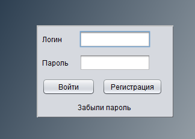

# Database_Application
Applications for controlling mail items using a database

Application made in NetBeance IDE
=======
Application functions: Database login, Database registration, Parcel/customer registration, parcel control, adding, deleting, changing a parcel and client.

